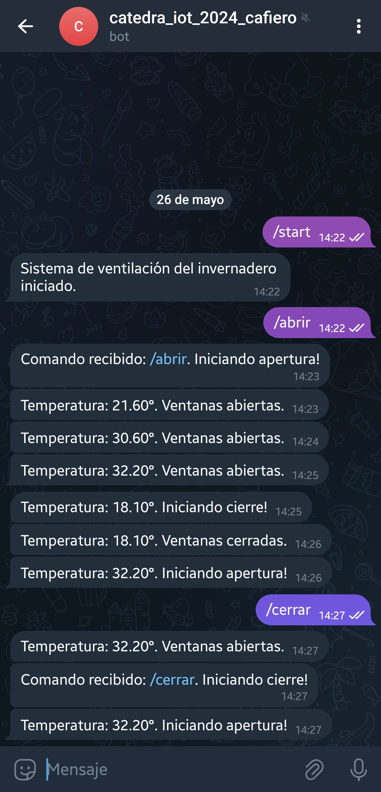

# Practica ESP32 - Parte 1

La idea de este trabajo consiste en brindar una solución basada en el ESP32 , que
teniendo en cuenta los valores de temperatura de un invernadero permita
determinar si es conveniente activar la apertura de las ventanas laterales para su
ventilación. Si la temperatura es mayor que 30 °C abriremos las ventanas. Si es
menor de 20 °C debemos cerrarlas.
Los valores del sensor de temperatura podrán simularse usando la función random
o bien conectando cualquier sensor que tengan acceso ( tipo DHT o sonda
Ds18b20) .

La actuación del motor para apertura/cierre lo vamos a modelar usando el led
integrado (- pin 2 si lo tuvieran, sino por puerto Serie -, simulando el envío de un
pulso de activación de 10 segundos ). Debiendo encender el led durante 10
segundos cuando se opera el motor ( su apertura o cierre) . Luego deberá quedar
apagado.

Por último, se deberá notificar al usuario vía Telegram a un bot que debemos crear
para tal fin (ver guía anexa). Armar el bot con el nombre “catedra_iot_2024_apellido”
Regularmente debemos enviar los valores de temperatura (ej. cada 5 min), el estado
de las ventanas(abiertas/cerradas) y avisar cuando se activa el motor ( por apertura
o cierre). El usuario a su vez, podrá forzar la apertura/cierre del motor con un
comando (ej, /abrir, /cerrar).

## Imagen del Bot de Telegram

